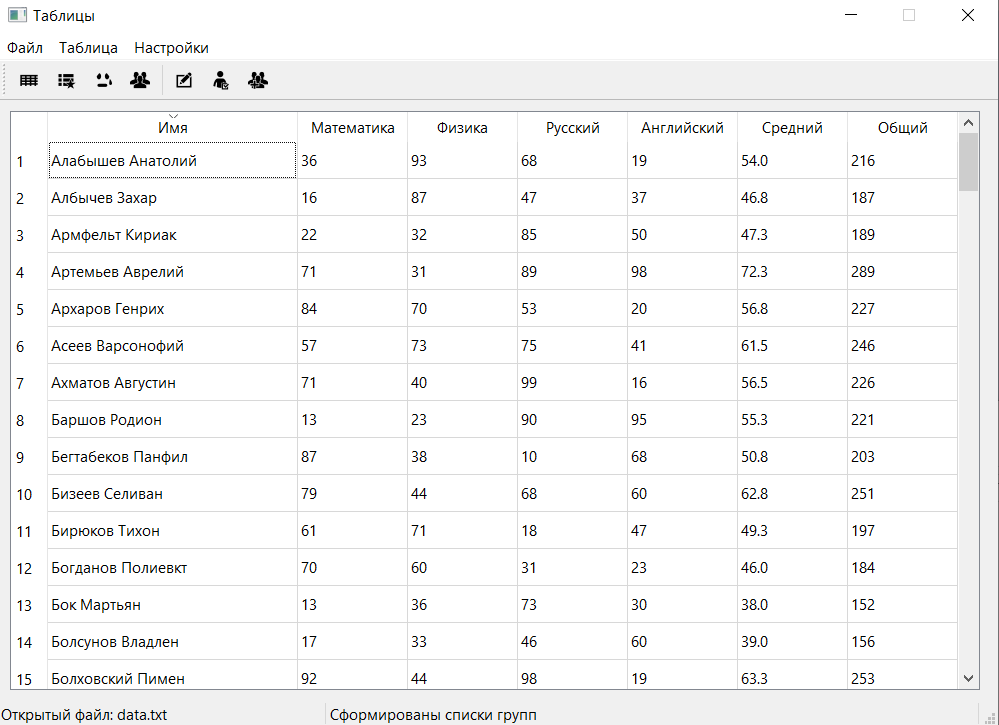
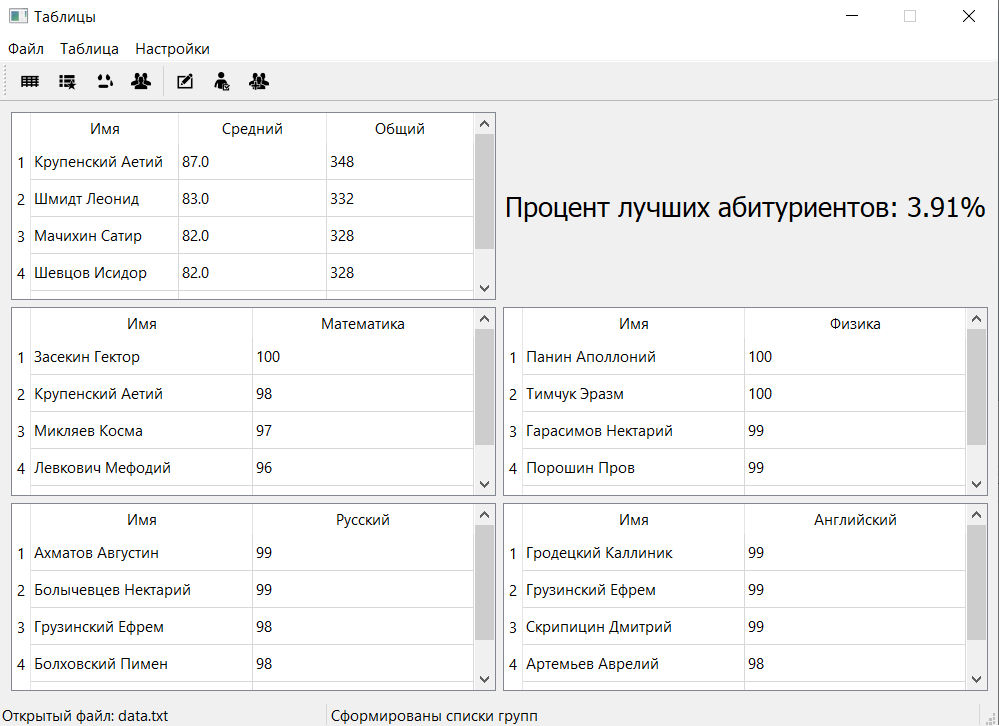
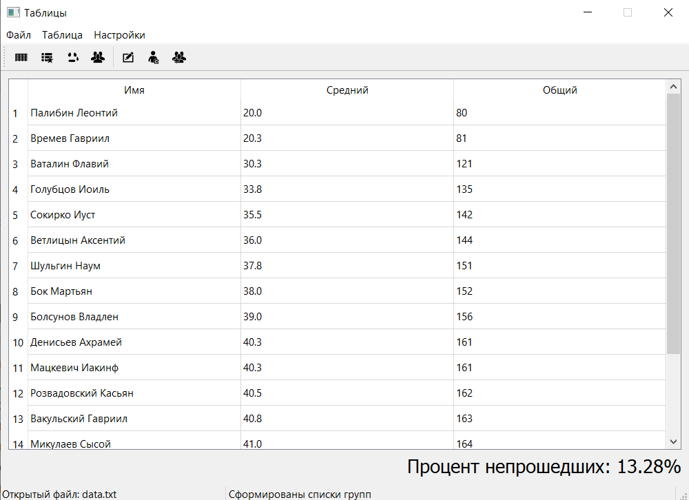
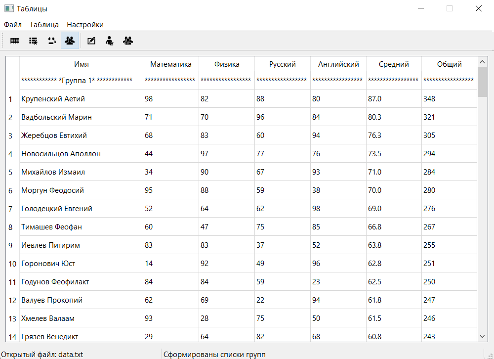

<h1> GUI Table application on Qt. </h1>

Application for representing data of exams in table view with sorting and grouping.

 
Made with <a href="https://doc.qt.io/qt-5/model-view-programming.html">Model-View-Controller (MVC)</a> pattern and 
inheritance <a href="https://doc.qt.io/qt-5/qabstracttablemodel.html">QAbstractTableModel</a>.

<h2> In work </h2>

- Open new file. First view is whole table.

 

- Next is view of students that have highest points.

 

- Students that did't pass minimum sum point.

 

- Grouped view with average point of group.

#### _NOTE!_

You can setup view in tool bar or setting menu.

<h2>Link </h2>
<a href="https://github.com/alohaeee/Programming-On-High-Level-Language/tree/master/Qt/TableLab">Project hyper-link</a>
