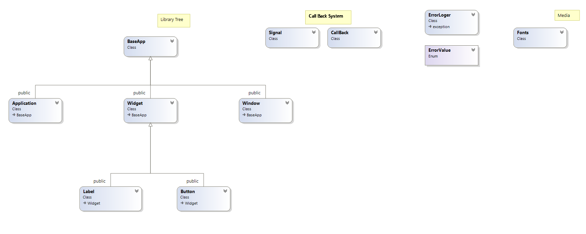

# GUI_API_SDL
Small GUI API for SDL.

## Class Diagram


## How to use
**Basically** u may make inheritance from any class of library.
But make sure to **override pure interfaces** of class, like in _Application_ class:
```
// INTERFACE
// Initialization method of application.
// Calls one time in start of Application.
virtual void initialization() = 0;
// INTERFACE
// Update method of application.
// Additional update method.
virtual void update() = 0;
// INTERFACE
// Update render of application.
// Additional render method.
virtual void render() = 0;
``` 
U can see whole 
[project example here](https://github.com/alohaeee/Programming-On-High-Level-Language/tree/master/SDL2/LAB2/LAB2SDL).
## Prerequisites
SDL2 and SDL2_ttf.

## Installing
Compile GUI_API_SDL in static or dynamic library and link to ur project.

**Example of project setting in VS.**

- Additional Include Directories:
```
C:\Programming On High-Level Language\SDL2\LAB2\GUI_API_SDL\GUI_API_SDL_StaticLibrary\include
C:\SDL2\SDL2-2.0.10\include
C:\SDL2\SDL2_ttf-2.0.15\include
``` 
- Additional Library Directories:
``` 
C:\Programming On High-Level Language\SDL2\LAB2\GUI_API_SDL\Debug (> ds)
C:\SDL2\SDL2-2.0.10\lib\x86
C:\SDL2\SDL2_ttf-2.0.15\lib\x86
``` 
- Additional Dependencies:
``` 
SDL2.lib
SDL2main.lib
SDL2_ttf.lib
GUI_API_SDL_StaticLibrary.lib 
``` 


