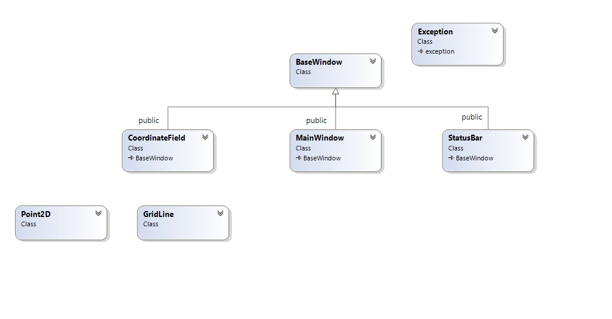
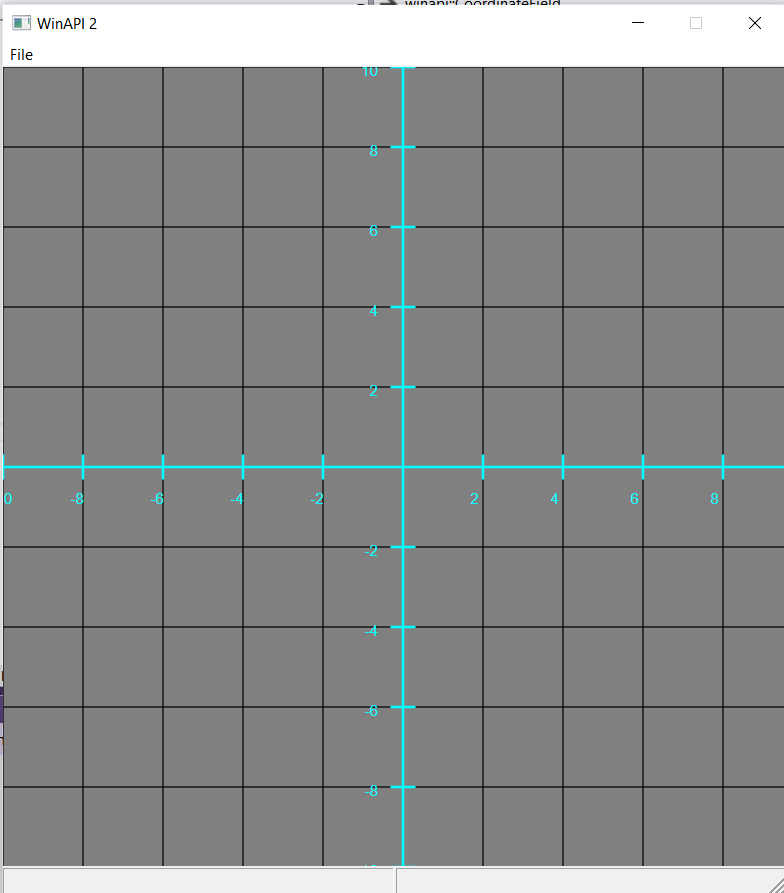
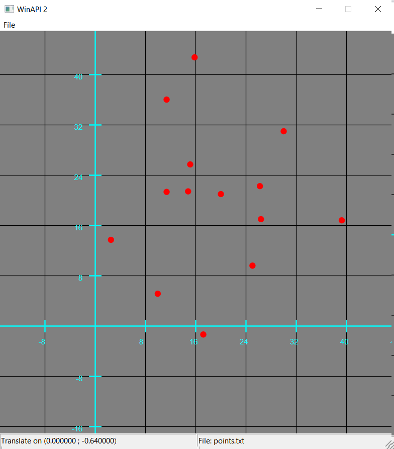
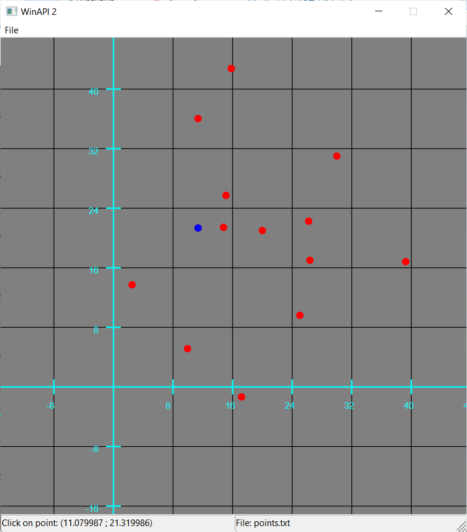
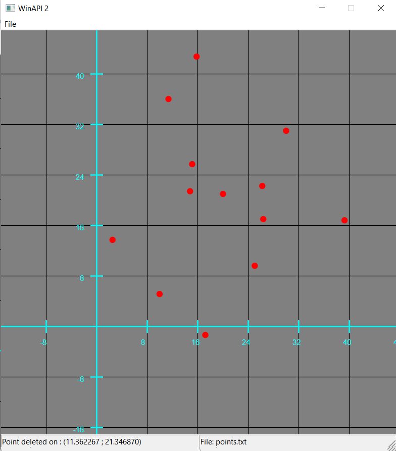
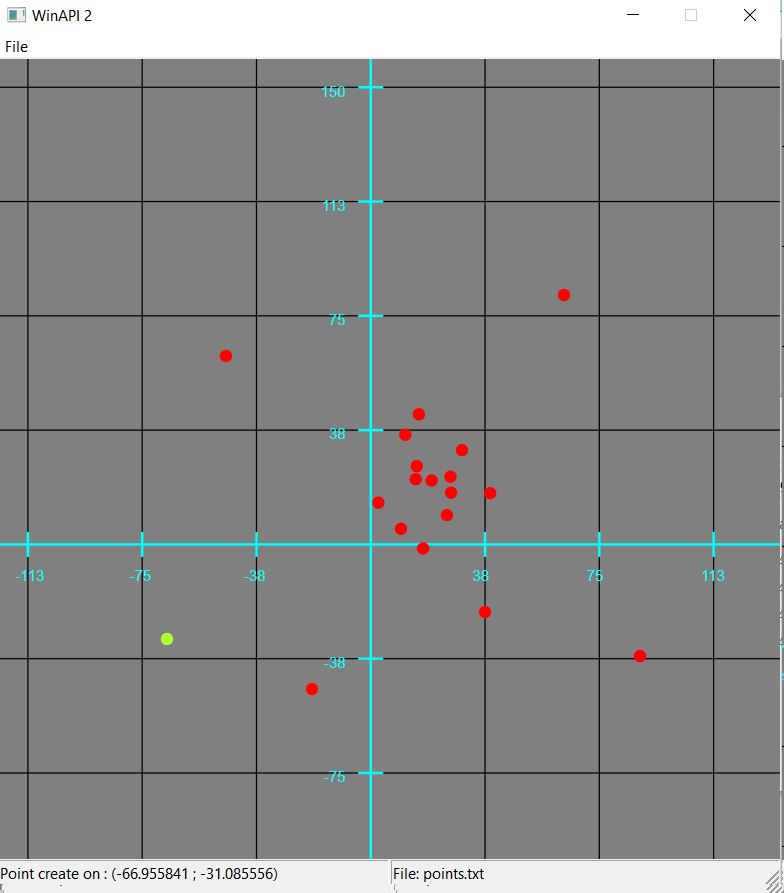

# WinApi32 application.
GUI application graphic for points with scale and scrolling.

## Class Diagram

## In work
- First view after open application.

 

- Open .txt file with points in cartesian coordinates.

 

- Target one point.

 

- And delete it with backspace.

 

- Add new points to cartesian view with double click. Scale view with mouse wheel and scrolling around axis with draging.

## Where to find

[Project hyperlink](https://github.com/alohaeee/Programming-On-High-Level-Language/tree/master/WinApi/WinAPI_2/WinAPI_2).
## Prerequisites
WinApi32.

